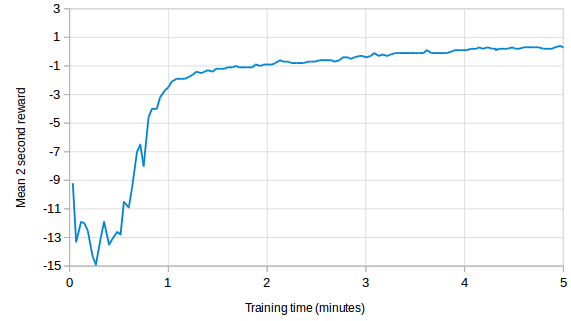

# ppg-pong
Using Parallel Policy Gradients with MPI and few dependencies to learn to play Atari Pong. It's really fast and despite being a ridiculously simple neural network it learns to defeat Pong in less than 5 minutes (on 1536 cores).

This simple implementation is based on Andrej Karpathy's excellent example code: 
    https://gist.github.com/karpathy/a4166c7fe253700972fcbc77e4ea32c5

You can read more details in the blog post here:
    https://www.allinea.com/blog/201610/deep-learning-episode-3-supercomputer-vs-pong

## Dependencies

- Numpy
- mpi4py
- OpenAI Gym

## Example

```
$ mpirun -n 4 python ppg-pong.py
[2016-12-07 08:28:50,733] Making new env: Pong-v0
[2016-12-07 08:28:50,735] Making new env: Pong-v0
[2016-12-07 08:28:50,735] Making new env: Pong-v0
[2016-12-07 08:28:50,736] Making new env: Pong-v0
Running with 4 processes
     2, 0000002675 steps @   1054/s: -10.8 | -10.7500 @ 1.0e-03 lr, 10750.0 r/Kup
     4, 0000005207 steps @   1047/s: -10.2 | -10.7250 @ 1.0e-03 lr,   500.0 r/Kup
     7, 0000007745 steps @   1045/s: -10.0 | -10.6887 @ 1.0e-03 lr,   625.0 r/Kup
     9, 0000010270 steps @   1043/s:  -6.8 | -10.4918 @ 1.0e-03 lr,  1062.5 r/Kup
    12, 0000012810 steps @   1043/s: -12.0 | -10.5672 @ 1.0e-03 lr,   458.3 r/Kup
    14, 0000015342 steps @   1040/s: -11.0 | -10.5889 @ 1.0e-03 lr,   138.9 r/Kup
    17, 0000017842 steps @   1038/s: -10.0 | -10.5594 @ 1.0e-03 lr,   131.9 r/Kup
    19, 0000020388 steps @   1040/s: -11.2 | -10.5939 @ 1.0e-03 lr,  -406.2 r/Kup
    22, 0000022907 steps @   1040/s: -10.8 | -10.6017 @ 1.0e-03 lr,  -390.6 r/Kup
    24, 0000025438 steps @   1040/s:  -8.2 | -10.4842 @ 1.0e-03 lr,   -60.0 r/Kup
    26, 0000027992 steps @   1040/s:  -9.2 | -10.4225 @ 1.0e-03 lr,   -26.7 r/Kup
    ...
    92, 0000096483 steps @   1046/s: -10.8 |  -9.6679 @ 1.0e-03 lr,    27.0 r/Kup
    94, 0000099001 steps @   1046/s: -10.0 |  -9.6845 @ 1.0e-03 lr,    25.3 r/Kup
    97, 0000101520 steps @   1045/s:  -9.2 |  -9.6628 @ 1.0e-03 lr,    28.8 r/Kup
    99, 0000104046 steps @   1045/s:  -9.8 |  -9.6671 @ 1.0e-03 lr,    27.7 r/Kup
   101, 0000106581 steps @   1045/s:  -8.2 |  -9.5963 @ 1.0e-03 lr,    28.3 r/Kup
   104, 0000109107 steps @   1045/s:  -7.5 |  -9.4915 @ 1.0e-03 lr,    32.2 r/Kup
   106, 0000111613 steps @   1045/s:  -7.0 |  -9.3669 @ 1.0e-03 lr,    32.0 r/Kup
   109, 0000114130 steps @   1044/s: -10.5 |  -9.4235 @ 1.0e-03 lr,    29.3 r/Kup
```

After training for 3.9 minutes on 1536 cores this agent learns to defeat Atari Pong (reward >0):



Note that the training reward is averaged over 2 second windows (see the blog post for more details). The test reward when played out over an entire game (first to 21 points) continues to increase with additional training time.
